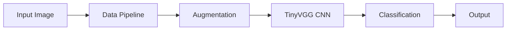

## Overview
Built and deployed a lightweight CNN architecture achieving 73% accuracy with 15.17s training time, optimized for edge devices and real-world deployment.

## Technical Architecture
- **Model**: Custom-designed lightweight CNN (TinyVGG architecture) optimized for edge deployment
- **Framework**: PyTorch with CUDA acceleration
- **Dataset**: Curated subset of Food101 dataset (3 classes, 75 training/25 testing images per class)
- **Input Pipeline**: Automated image processing with data augmentation
- **Performance**: 73% classification accuracy with 15.17s training time on CPU

## Challenges and Solutions
- **Overfitting Mitigation**: Addressed overfitting by incorporating data augmentation techniques such as TrivialAugmentWide, improving generalization on unseen data.
- **Scalability**: Designed the system to scale efficiently with larger datasets by leveraging PyTorch’s modular design for easy expansion.

## Learning Outcomes
* Gained expertise in designing and implementing custom CNN architectures tailored for specific tasks.
* Developed skills in data preprocessing and augmentation to enhance model robustness.
* Learned advanced PyTorch techniques for building scalable and efficient machine learning pipelines.

To view the project code, visit the [GitHub repository](https://github.com/Hit07/ML-DL-Torch/tree/main)

